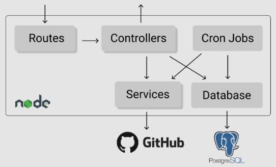

# LibQuality Backend
Busque por métricas e histórico de repositórios do GitHub.

## Referência das rotas

### Issues:
* Métricas das issues: `GET /issues?owner=<repo_owner>&repo=<repo_name>&user=<username>`

### Histórico:
* Obter histórico diário de métricas: `GET /issues?owner=<repo_owner>&repo=<repo_name>&user=<username>`
* Adicionar repositório para ser monitorado: `POST /history/repo`
```
body: {
	"owner": "[String]",
	"repo": "[String]"
}
```
* Remover repositório do histórico: `DELETE /history/repo`
```
body: {
	"owner": "[String]",
	"repo": "[String]"
}
```

## Arquitetura
Diagrama geral da solução:



Modelagem do banco de dados:


A aplicação utiliza o framework express e é dividida entre os módulos:
- Routes: é reponsável pelo roteamento das chamadas à API, essas requisições são enviadas para o controlador correto de acordo com a entidade do endpoint e o método HTTP.
- Controllers: é responsável por tratar as requisições, consultar serviços externos utilizando os módulos services e database e fazer a manipulação dos dados recebidos.
- Services: fornece interfaces para acesso aos dados de serviços externos, como o GitHub, por exemplo. É utilizado o axios para fazer as chamadas HTTP.
- Database: disponibiliza acesso ao banco de dados utilizando a lib knex como query builder.
- Jobs: define os cron jobs necessários para o cumprimento de regras de negócio. Essas definições utilizam os módulos services e database. É utilizada a lib node-cron para a execução.

Conexões externas:
- GitHub API: Utilizado para obter as métricas dos repositórios. [Ver documentação v3 da API](https://docs.github.com/en/free-pro-team@latest/rest).
- PostgreSQL: Banco de dados utilizado por sua facilidade e ampla utilização no mercado.

## Execução
Premissa: é necessário ter instalado docker

Faça a instalação de dependências
```
yarn
```

Crie um arquivo com nome `.env` e o preencha seguindo o padrão que pode ser encontrado no arquivo `.sample.env`

### Em desenvolvimento:
Inicie o banco de dados
```
docker-compose -f docker-compose.dev.yml up
```

Execute as migrations para criar as tabelas no banco
```
yarn migrate:dev
```

Inicie a aplicação de backend
```
yarn start
```

### Deploy em produção:
Faça o buid da imagem node de acordo com o Dockerfile e envie a imagem para o servidor de deploy
```
docker build -t lib_quality_node .
```

Caso seja ao primeiro deploy, no servidor, crie o volume docker externo
```
docker volume create --name=postgres_db
```

Inicie os serviços da aplicação
```
docker-compose up
```

Caso seja ao primeiro deploy, execute as migrations para criar as tabelas no banco
```
yarn migrate
```

Se deseja alterar o nome do build da imagem ou do volume do banco faça também a mudança no arquivo `docker-compose.yml`

## Testes
Primeiro, inicie o banco de dados
```
docker-compose -f docker-compose.dev.yml up
```

Inicie as tabelas
Execute as migrations para criar as tabelas no banco
```
yarn migrate:test
```

Execute os testes da aplicação
```
yarn test
```